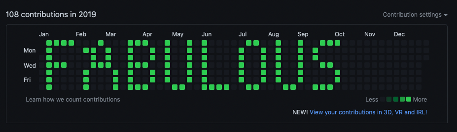

# Commit History Art

In the project directory, you can run:

`./run.sh`

Generates commits in such a way that a desired message is formed in contribution history. You can modify the the year and message in the run script.

